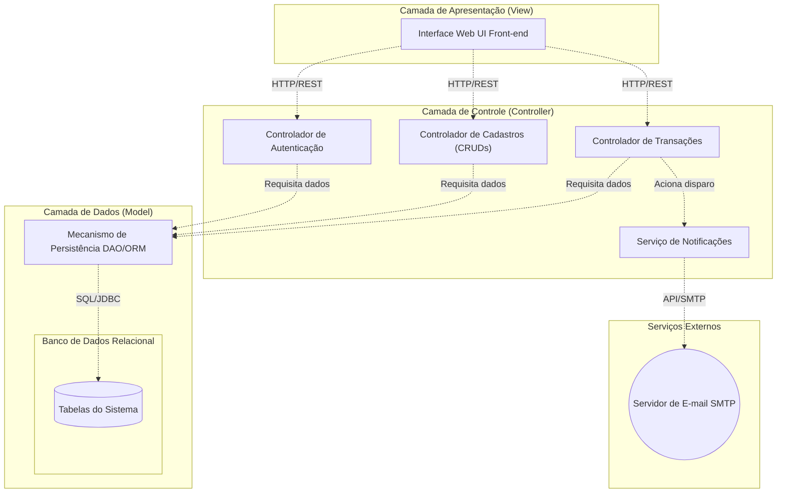

```mermaid
flowchart TD
    subgraph View ["Camada de Apresentação (View)"]
        UI["Interface Web UI Front-end"]
    end

    subgraph Controller ["Camada de Controle (Controller)"]
        Auth["Controlador de Autenticação"]
        CRUD["Controlador de Cadastros (CRUDs)"]
        Trans["Controlador de Transações"]
        Notif["Serviço de Notificações"]
    end

    subgraph Model ["Camada de Dados (Model)"]
        DAO["Mecanismo de Persistência DAO/ORM"]
        
        subgraph DB ["Banco de Dados Relacional"]
            Tables[("Tabelas do Sistema")]
        end
    end

    subgraph External ["Serviços Externos"]
        SMTP(("Servidor de E-mail SMTP"))
    end

    %% Relações Front-end -> Back-end
    UI -. "HTTP/REST" .-> Auth
    UI -. "HTTP/REST" .-> CRUD
    UI -. "HTTP/REST" .-> Trans

    %% Relações Back-end -> Banco de Dados
    Auth -. "Requisita dados" .-> DAO
    CRUD -. "Requisita dados" .-> DAO
    Trans -. "Requisita dados" .-> DAO

    %% Relações Banco de Dados Interna
    DAO -. "SQL/JDBC" .-> Tables

    %% Relações Back-end -> Serviços Externos
    Trans -. "Aciona disparo" .-> Notif
    Notif -. "API/SMTP" .-> SMTP
```