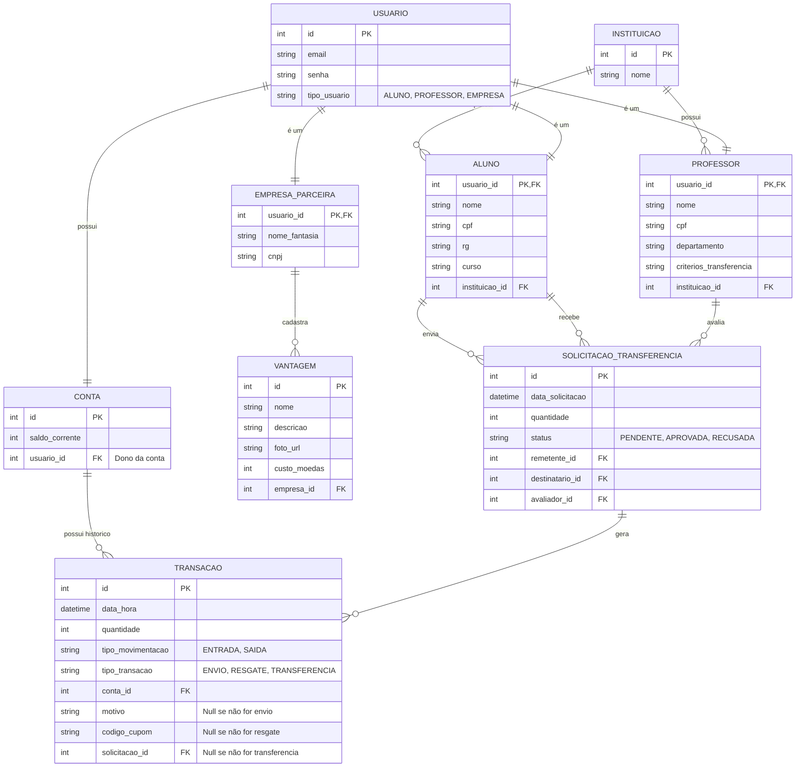

```mermaid
erDiagram
    INSTITUICAO {
        int id PK
        string nome
    }

    USUARIO {
        int id PK
        string email
        string senha
        string tipo_usuario "ALUNO, PROFESSOR, EMPRESA"
    }

    ALUNO {
        int usuario_id PK, FK
        string nome
        string cpf
        string rg
        string curso
        int instituicao_id FK
    }

    PROFESSOR {
        int usuario_id PK, FK
        string nome
        string cpf
        string departamento
        string criterios_transferencia
        int instituicao_id FK
    }

    EMPRESA_PARCEIRA {
        int usuario_id PK, FK
        string nome_fantasia
        string cnpj
    }

    CONTA {
        int id PK
        int saldo_corrente
        int usuario_id FK "Dono da conta"
    }

    VANTAGEM {
        int id PK
        string nome
        string descricao
        string foto_url
        int custo_moedas
        int empresa_id FK
    }

    SOLICITACAO_TRANSFERENCIA {
        int id PK
        datetime data_solicitacao
        int quantidade
        string status "PENDENTE, APROVADA, RECUSADA"
        int remetente_id FK
        int destinatario_id FK
        int avaliador_id FK
    }

    TRANSACAO {
        int id PK
        datetime data_hora
        int quantidade
        string tipo_movimentacao "ENTRADA, SAIDA"
        string tipo_transacao "ENVIO, RESGATE, TRANSFERENCIA"
        int conta_id FK
        string motivo "Null se não for envio"
        string codigo_cupom "Null se não for resgate"
        int solicitacao_id FK "Null se não for transferencia"
    }

    %% Relacionamentos
    INSTITUICAO ||--o{ ALUNO : "possui"
    INSTITUICAO ||--o{ PROFESSOR : "possui"
    
    USUARIO ||--|| ALUNO : "é um"
    USUARIO ||--|| PROFESSOR : "é um"
    USUARIO ||--|| EMPRESA_PARCEIRA : "é um"
    
    USUARIO ||--|| CONTA : "possui"
    EMPRESA_PARCEIRA ||--o{ VANTAGEM : "cadastra"
    CONTA ||--o{ TRANSACAO : "possui historico"
    
    ALUNO ||--o{ SOLICITACAO_TRANSFERENCIA : "envia"
    ALUNO ||--o{ SOLICITACAO_TRANSFERENCIA : "recebe"
    PROFESSOR ||--o{ SOLICITACAO_TRANSFERENCIA : "avalia"
    SOLICITACAO_TRANSFERENCIA ||--o{ TRANSACAO : "gera"
```